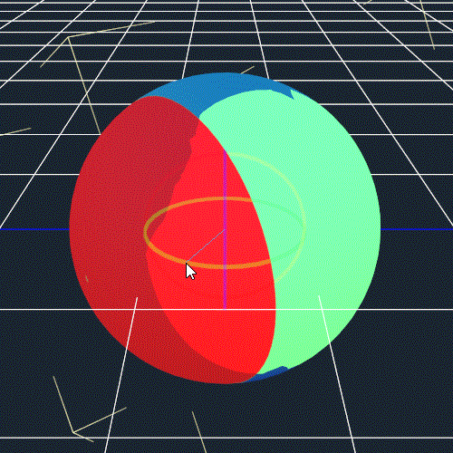
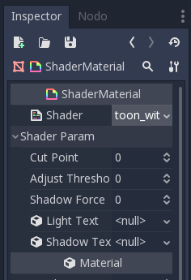

# GodotToonShader
An implementation of a custom toon shader made with Godot shading language. 

## Godot Simple Toon Shader

GodotToonShader is my first spatial shader made with Godot Engine. At the current stage it is very simple, but it works. Some customization will come. I hope to help someone out there who was struggling to create shader like me.

Version 1.0:

Finally it is online! Currently I'm testing the shader so it's still in an early stage, but it is working good. Normal maps are working good! I don' know (at the moment) if they are pefect but for the moment they are ok. 

How to use it:

1) Create a new ShaderMaterial;
2) Load my toonProva.shader into the shader box;
3) (TEMPORARY) since it seems that Godot Shading Language has a problem with assigning default values to uniforms (but it should be fixed for release 3.1) you have to Adjust the parameters.
   The default values are:  
   Color -> White (All 1.0)  
   Use Texture -> On (Still you need to load a texture in order to see textures, so if you just want to use a color turn it off)  
   Use Normal Map -> Off (To use a normal map, just sey it to "on" and load a normalMap. Remember to import it in the correct way, or they won't work good)  
   Amount Of Light -> 0.8 (this value indicate to the shader how much "lit" is the surface)  
   Amount of Shadow -> 0.2 (this value indicate how much "unlit" is the surface)  
   Cut Point -> 0.5 (It is used to fix the position shadow on the surface)  
       
And that's it! Feel free to use it anyway you want, i will probably add comments to the code today so you can tune yourself the code if you need it.

## Godot Guilty Gear Style Shader (Version 1.0)

  

This is my new Shader for Godot!

 ### Description
 
 This shader is based on the shader from Gulity Gear Xrd. I think the way the developers achieved the result is quite genius and crazy and, since it really looks awesome, I created one. The actual functioning is very simple. You can use only one light with this shader (in the game every character had his own light vector that didn't affect other characters), but the result is quite good I think.
 
 ### How to use it?
 
 The shader is actually quite simple. To use the shader you need it to save my shader into your project's folder, then you need to attach a ShaderMaterial to your mesh and load the shader file (toon_with_texture.shader) into the ShaderMaterial.
 You should see something similar:
     

  

1. Cut Point decides the position where object begins to be unlit (DEFAULT 0.5)
2. Adjust Threshold is needed only if you are using VERTEX COLOR to threshold lightning (DEFAULT 1)
3. Shadow Force decides the power of Shadow texture (DEFAULT 1.0, but probably needs to be lowered, that's up to you)
4. Load your light texture here
5. Load your shadow texture here

### How does it work?
It's pretty simple. The shader calculates ligthning over the white object (and Vertex Color red channel, if used) and that's lerped (with smoothstep function) from 0.0 to 1.0, so you can easily control where to cut lights, with the function calc_shading(). This function returns a boolean, so if it returns true the object receives ALBEDO as LIGHT, if it returns false it receives ALBEDO\*shadow\*shadow_force. I will probably change this function to render more "light strips", I used the boolean just for convenience. 

--------------------------------------------------------------------------------------------------------------------------------

For version 1.1 I'm fixing usage of multiple lights, and I'm building a new shader that's very similar to "Guilty Gear Xrd"'s shader (I hope the title is right ahah) because I wanted to achieve a similar result in my next game. And since Godot is a free and open-source software I'm planning to release all the (interesting) code I'm creating, so a lot of noobs (like me) won't have to learn a shading language without examples ahah. Hope you will enjoy it!
